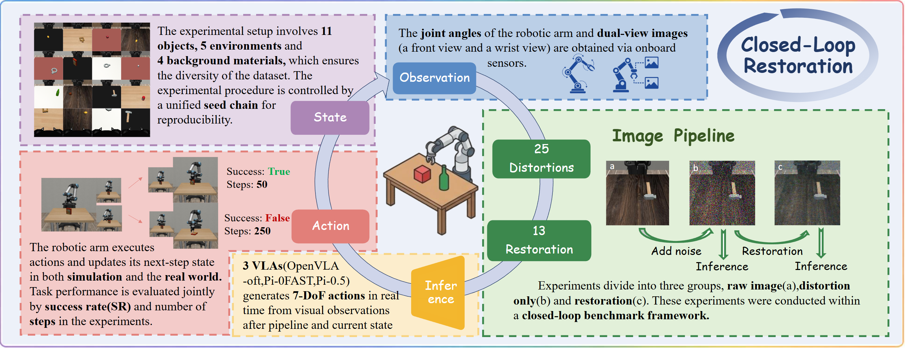

<div align="center">

 <h1>Embodied Image Restoration</h1>

The first embodied image restoration benchmark

 
 <div style="width: 100%; text-align: center; margin:auto;">
      
 </div>
</div>

Existing image restoration methods are primarily optimized for human visual perception or conventional machine vision tasks, while their actual value for embodied agents in closed-loop decision-making remains underexplored. 

To advance image restoration for robot vision systems, we developed EmbodiedRestore. EmbodiedRestore is a closed-loop benchmark frame for VLA   (Vision-Language-Action) model build upon RmbodiedComp, which use robosuite to build a environment with random texture and objects for an UR5 robotic arm with Pi0-FAST,Pi0.5 and OpenVLA-oft agents. The visual signals are processed by noise and image restoration before being sent to the VLA model for inference. In the closed loop, the correspondence between the image and the task success rate/number of steps is obtained.


<div align="center">

🤗 [Dataset Download](https://huggingface.co/datasets/qruisjtu/EmbodiedRestore) | 📚 [Paper]() | 📈[Benchmark]()

</div>

## Release
- [2026/5/5] 🤗 [Image dataset](https://huggingface.co/datasets/qruisjtu/EmbodiedRestore) for **EmbodiedRestore** is upgrade
- [2026/5/5] 🔥 [Github repo](https-link) for **EmbodiedRestore** is online.


# Installing
Prepare environment
```bash
git clone https://github.com/Qruisjtu/EmbodiedRestore.git
cd EmbodiedRestore
# conda env create (this may take a while)
conda env create -n EIR
# activate conda
conda activate EIR
```
Or you can prepare environment by 
```bash
pip install -r requirment.txt
```
Install openpi-client:
```bash
cd packages/openpi-client
pip install -e .
cd ../..
```


# Benchmark with openvla
For openvla,run directly(Openvla requires 20GB VRAM for interfacing)
```
python openvla.py
```
It will start downloading weight from huggingface and start benchmark with default settings, you can also change the `BENCHMARK PARAMETERS` in `openvla.py`, including text prompt, benchmark's name, agent's name, etc.
You can change the`pretrained_checkpoint= `in [openvla.py](openvla.py#L69) to your own weight path. 

The benchmark's result will be saved under folder `data/benchmark`
# Benchmark with Pi0&Pi05
We use openpi-client to interact with pi0 and pi0.5, that means you have to start pi agent server first with its own environment.You can see [pisetup](doc/pisetup.md) for our config for ur5 robot.And you can download our finetuned weight [here](https://huggingface.co/qruisjtu/pi_ur5_fintuned). After the pi client is start,you can change the `BENCHMARK PARAMETERS` in `pi.py` including text prompt, benchmarkname, agentname,etc.Then run
```
python pi.py
```
The benchmark's result will be saved under folder `data/benchmark`

# Benchmark your own image restoration model
EmbodiedRestore treats every image restoration method as a `Codec` node. To benchmark a new restoration model, add one model implementation under `compress/`, wrap it in `compress/compressimg.py`, and then select it in the `noise_thread` pipeline of `pi.py` or `openvla.py`.

## 1. Add your model implementation

Create `compress/xxx_impl.py`, where `xxx` is the name of your restoration method. The file should expose two functions:

- `init_xxx()`: load the local model code and weights once.
- `xxx_enhance(image: np.ndarray, ...) -> np.ndarray`: receive one RGB image array in HWC format and return one restored RGB image array in HWC format.

Example:

```python
# compress/xxx_impl.py
import sys
from pathlib import Path

import numpy as np
import torch

XXX_REPO_DIR = Path("/path/to/your/local/xxx/repo")
XXX_WEIGHT_PATH = Path("/path/to/your/local/xxx/weights/model.pth")

if str(XXX_REPO_DIR) not in sys.path:
    sys.path.insert(0, str(XXX_REPO_DIR))

_MODEL = None
_DEVICE = "cuda" if torch.cuda.is_available() else "cpu"


def init_xxx():
    global _MODEL
    if _MODEL is not None:
        return _MODEL

    # Import your model from XXX_REPO_DIR and load local weights here.
    # from your_model_package import build_model
    # model = build_model(...)
    # checkpoint = torch.load(XXX_WEIGHT_PATH, map_location=_DEVICE)
    # model.load_state_dict(checkpoint["params"], strict=True)
    # model.to(_DEVICE).eval()
    # _MODEL = model
    return _MODEL


@torch.no_grad()
def xxx_enhance(image: np.ndarray, step: int = 0, cam: str = "compressimg") -> np.ndarray:
    if _MODEL is None:
        init_xxx()

    if image is None:
        return image
    if not isinstance(image, np.ndarray):
        image = np.array(image)
    if image.dtype != np.uint8:
        image = np.clip(image, 0, 255).astype(np.uint8)
    if image.ndim == 2:
        image = np.stack([image] * 3, axis=-1)
    if image.shape[-1] != 3:
        raise ValueError(f"Expected HWC RGB image, got shape={image.shape}")

    # Convert image to your model input format, run inference,
    # then convert the output back to uint8 RGB HWC ndarray.
    restored = image
    return restored
```

Replace `XXX_REPO_DIR`, `XXX_WEIGHT_PATH`, model construction, weight loading, preprocessing, and postprocessing with your local implementation.

## 2. Register the model in `compress/compressimg.py`

Import your implementation at the top of `compress/compressimg.py`:

```python
from compress.xxx_impl import init_xxx, xxx_enhance
```

Then add an `Enhance` wrapper:

```python
class XXXEnhance(Enhance):
    def __init__(self, quality):
        super().__init__(quality, "xxx")

    def init(self):
        init_xxx()

    def compress(self, image_array):
        if image_array is None:
            return image_array, 24
        if not isinstance(image_array, np.ndarray):
            image_array = np.array(image_array)
        if image_array.dtype != np.uint8:
            image_array = np.clip(image_array, 0, 255).astype(np.uint8)

        rec_np = xxx_enhance(image_array, step=0, cam="compressimg")
        return rec_np, 24
```

The returned `24` is a placeholder bpp value for restoration-only methods. The closed-loop benchmark uses the restored observation for VLA inference.

## 3. Select the model in `noise_thread`

In `pi.py` or `openvla.py`, import the wrapper in `noise_thread` and add it to the `Enhance` list:

```python
from compress.compressimg import (
    Distorter,
    VarFormerEnhance,
    HypirEnhance,
    XXXEnhance,
)

Enhance = [VarFormerEnhance, HypirEnhance, XXXEnhance][etype]
```

The benchmark builds the restoration flow with `compressimg.Pipeline`. For the no-noise baseline, the pipeline only runs restoration:

```python
cpr = compressimg.Pipeline([
    Enhance(quality=4),
])
```

For noisy observations, the pipeline first applies the selected degradation and then restores the degraded image:

```python
cpr = compressimg.Pipeline([
    Distorter(quality=1, type=ntype),
    Enhance(quality=4),
])
```

Run the benchmark with the selected `etype`. Results are saved under `data/benchmark/`, grouped by agent and enhancement class name.

## 4. Quick sanity check

Before launching the full robot benchmark, test the wrapper on one image:

```python
from PIL import Image
import numpy as np

from compress.compressimg import Distorter, Pipeline, XXXEnhance

image = np.array(Image.open("path/to/test.png").convert("RGB"))
cpr = Pipeline([
    Distorter(quality=1, type=0),
    XXXEnhance(quality=4),
])
restored, _ = cpr.compress(image)
Image.fromarray(restored).save("xxx_restored.png")
```

Check that the output is an RGB `uint8` image, has the same height and width as the input after `Pipeline.compress`, and does not trigger CUDA/model import errors.

<!-- ## Citation

If you find our work interesting, please feel free to cite our paper: -->


